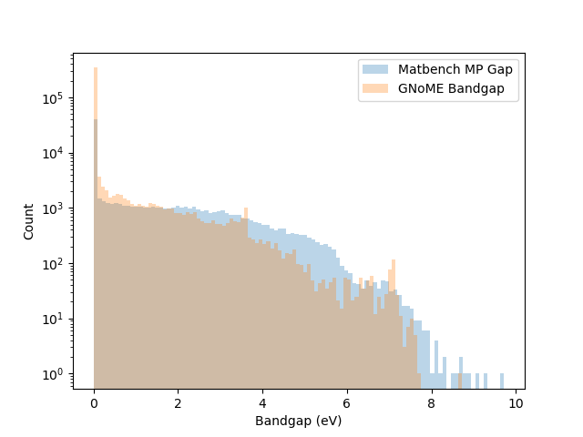
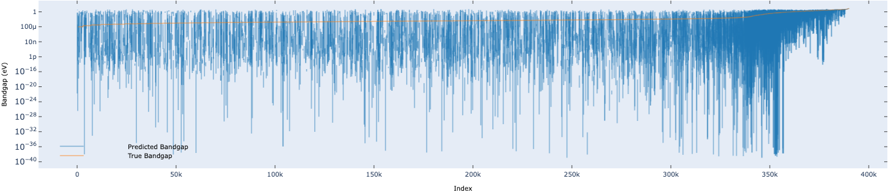
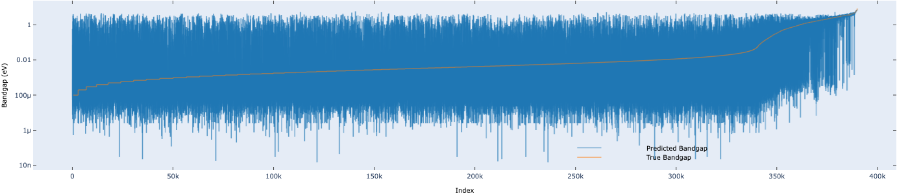
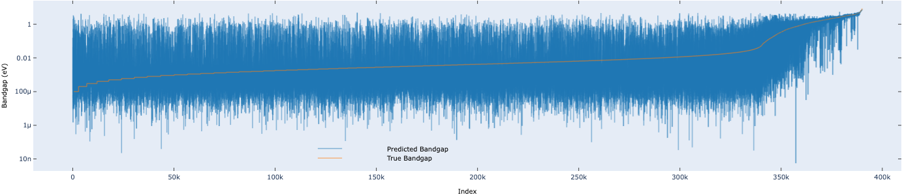

# Property Screening

Three models are fine-tuned with Matbench-MP-Gap data and do property screening on GNoME equilibrium structures (389918 samples with ground truth band-gap labels)

We do property screening to find structures whose band-gaps are within 1.0eV-3.0eV, which implies probably to be medium bandgap semiconductors that could be used in areas like integrated circuits and solar cells. 

## Data Distribution

## Fine-tuning on Matbench-MP-Gap

|           |JMP  |EqV2 | ORB |
|-          |-    |-    |-    |
|val-mae(eV)|0.153|0.106|0.094|     

## Prediction on GNoME

### JMP

|             |Actual Positive |Actual Negative |
|-            |-               |-               |
|Pred Positive|16645           |5194            |
|Pred Negative|3141            |364938          |

MAE: 0.0583

MSE: 0.0579

RMSE: 0.2407

Accuracy: 97.86%

Recall: 84.13%

F1 Score: 0.7998

### EqV2

|             |Actual Positive |Actual Negative |
|-            |-               |-               |
|Pred Positive|17383           |3628            |
|Pred Negative|2403            |366504          |

MAE: 0.0459

MSE: 0.0422

RMSE: 0.2054

Accuracy: 98.45%

Recall: 87.86%

F1 Score: 0.8522

### ORB

|             |Actual Positive |Actual Negative |
|-            |-               |-               |
|Pred Positive|18060           |3219            |
|Pred Negative|1726            |366913          |

MAE: 0.0386

MSE: 0.0243

RMSE: 0.1560

Accuracy: 98.73%

Recall: 91.28%

F1 Score: 0.8796

