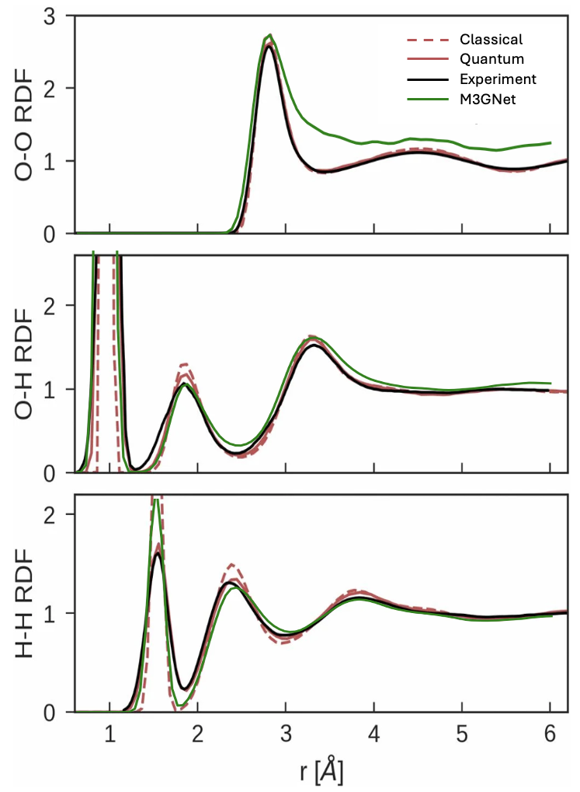

# Water Thermo-dynamics

M3GNet pretrained on MPTraj dataset is fine-tuned on [water thermo-dynamics dataset](https://github.com/BingqingCheng/ab-initio-thermodynamics-of-water/blob/master/training-set/dataset_1593.xyz) and then used as the calculator for Langevin MD under 300K. 

## Fine-tuning on Water Dataset

| |M3GNet 80% | ORB 3% | ORB 80% | JMP 3% | JMP 80% |
|-|-|-|-|-|-|
|val-e-mae(eV/atom)|0.0023|0.0075|0.0042|0.0008|0.0045|
|val-f-mae(eV/Angstrom)|0.1165|0.0725|0.0359|0.0077|0.0058

## Langevin MD Results

We run Langevin MD under 300K for 10ps using our fine-tuned M3GNet and ```ase```. We plotted water's RDF under 300K and compared with the RDF plots shown in [this paper](https://www.pnas.org/doi/10.1073/pnas.1815117116?gad_source=1&gclid=CjwKCAiA3ZC6BhBaEiwAeqfvypYgxez0SNYdhPxoHa_o6I3tXrouGHlZONdEVNFOoRz5fyoTDVLXcRoCScsQAvD_BwE):



Here the green line M3GNet is the results we got, and the experimental O–O RDF was obtained from [ref](https://pubs.aip.org/aip/jcp/article/141/21/214507/351929), and the experimental O–H and H–H RDFs were taken from [ref](https://www.sciencedirect.com/science/article/pii/S0301010400001798) and [ref](https://journals.aps.org/prl/abstract/10.1103/PhysRevLett.117.186401)